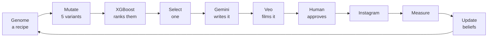

<div align="center">

# Memevolution

**What happens when an AI has to survive on the internet?**

An autonomous memetic agent that generates memes, posts them to a real Instagram
account, measures what actually happened, and evolves its strategy across generations.

[](https://www.python.org/)
[](https://fastapi.tiangolo.com/)
[](https://react.dev/)
[](https://www.typescriptlang.org/)
[](https://xgboost.readthedocs.io/)

Built at HopHacks 2026 for the Calcifer Computing Memetics Track.

</div>

---

## Table of contents

- [Why this exists](#why-this-exists)
- [How it works](#how-it-works)
- [Architecture](#architecture)
- [Quick start](#quick-start)
- [Configuration](#configuration)
- [Running a round](#running-a-round)
- [What the numbers mean](#what-the-numbers-mean)
- [Project structure](#project-structure)
- [API reference](#api-reference)
- [Testing](#testing)
- [Cost](#cost)
- [Troubleshooting](#troubleshooting)
- [Design principles](#design-principles)
- [Limitations](#limitations)

---

## Why this exists

Most content tools stop at generating. You get an output, you post it, and you
never find out whether the thing you believed about it was true.

Memevolution closes that loop. It treats internet culture as an evolutionary
system: ideas replicate, mutate, compete for attention, and either spread or
disappear. Every round it makes a measurable claim about what will spread, posts
it for real, reads what actually happened, and revises its beliefs when it was
wrong.

The result is not a meme generator. It is a system that holds opinions about
comedy and can defend them with evidence.

---

## How it works



1. **Mutate** — a parent *genome* (a set of creative dials, not a meme) is copied
   into five variants, each changed differently.
2. **Rank** — a frozen XGBoost model scores all five and predicts which spreads best.
3. **Select** — usually the top-ranked candidate; 20% of the time an uncertain one,
   because an uncertain prediction teaches more when it resolves.
4. **Write** — Gemini writes the actual joke for the winner only.
5. **Film** — Veo renders an 8-second vertical video with generated audio.
6. **Approve** — a human reviews and publishes. Nothing posts autonomously.
7. **Measure** — views, likes, comments, shares and saves are read back from Instagram.
8. **Learn** — the gap between predicted and observed fitness moves the agent's beliefs.

The winner becomes the parent of the next generation. The other four are dropped.

> **The separation that defines the architecture:** the model *ranks* and writes
> nothing. Gemini *writes* and ranks nothing. They never touch each other's job.

---

## Architecture

| Layer | Stack | Responsibility |
| --- | --- | --- |
| Frontend | React 18, TypeScript, Vite, Tailwind, Zustand | Three views: lineage, lab, learned beliefs |
| Backend | FastAPI, SQLAlchemy, Pydantic | Orchestration, persistence, publishing |
| Storage | SQLite (default) or TimescaleDB | Experiments, predictions, engagement time-series |
| Prediction | XGBoost (200 trees, 14 features) | Ranks candidate genomes — frozen, never retrains |
| Concepts | Gemini | Writes the joke, scene, caption and sound design |
| Video | Veo 3.1 | 8-second vertical video with generated audio |
| Publishing | Instagram Graph API | Reels upload and engagement readback |

### The three-tier media fallback

Video generation degrades gracefully, and every tier is labelled in the UI:

| `media_source` | Meaning |
| --- | --- |
| `veo` | A real generated video |
| `image-wrapped` | A generated still held as video — Veo was unavailable |
| `fallback` | A rendered card — neither model was reachable |

The system is allowed to degrade. It is never allowed to misreport that it did.

---

## Quick start

### Prerequisites

- **Python 3.11+**
- **Node.js 18+**
- A **Gemini API key** — [get one here](https://aistudio.google.com/apikey)
- *(Optional)* Instagram Business account + Meta app, to publish for real

### Install and run

```bash
git clone https://github.com/sthirum2/memevolution.git
cd memevolution
./setup.sh
```

Add your Gemini key to `backend/.env`:

```bash
GEMINI_API_KEY=your-key-here
```

Then start both services:

```bash
./dev.sh --seed
```

| Service | URL |
| --- | --- |
| Frontend | http://localhost:5173 |
| Backend | http://127.0.0.1:8000 |
| API docs | http://127.0.0.1:8000/docs |

`Ctrl-C` stops both. After the first run, plain `./dev.sh` is enough —
`--seed` only loads demo data into an empty database.

<details>
<summary><b>Manual setup, if you prefer</b></summary>

```bash
# Backend
cd backend
python3 -m venv .venv && source .venv/bin/activate
pip install -r requirements.txt
cp .env.example .env
uvicorn app.main:app --port 8000

# Frontend, in a second terminal
cd frontend
npm install
npm run dev
```

</details>

---

## Configuration

All backend config lives in `backend/.env` (gitignored — copy from `.env.example`).

### Required

| Variable | Description |
| --- | --- |
| `GEMINI_API_KEY` | Writes meme concepts and generates images/video |

### Storage

| Variable | Default | Description |
| --- | --- | --- |
| `DATABASE_URL` | `sqlite:///./memevolution.db` | SQLite by default; TimescaleDB for engagement time-series |
| `CORS_ORIGINS` | localhost:3000, :5173 | Comma-separated allowed frontend origins |

### Video quality and cost

| Variable | Default | Description |
| --- | --- | --- |
| `VEO_TIER` | `fast` | `lite`, `fast` or `standard` — see [Cost](#cost) |
| `VEO_RESOLUTION` | `720p` | `1080p` costs slightly more per second |

### Instagram publishing (optional)

| Variable | Description |
| --- | --- |
| `IG_ACCESS_TOKEN` | Long-lived token (60 days) |
| `IG_USER_ID` | Instagram Business account ID |
| `IG_APP_ID` / `IG_APP_SECRET` | Meta app credentials, used to refresh tokens |
| `PUBLIC_MEDIA_BASE` | Public HTTPS origin serving `/media` |

**Required token scopes:**

| Scope | Needed for |
| --- | --- |
| `instagram_basic` | Likes and comments |
| `instagram_content_publish` | Posting |
| `instagram_manage_insights` | **Views, shares and saves** |

> Without `instagram_manage_insights`, views cannot be read — and because fitness
> divides by views, the learning loop cannot close on a live post. Likes and
> comments still work.

`PUBLIC_MEDIA_BASE` must be publicly reachable, because Meta fetches media from
its own servers. For local development:

```bash
./scripts/tunnel.sh
```

### Billing via Google Cloud instead

To bill Gemini/Veo to a GCP project (e.g. free-trial credit) rather than the
Gemini prepay balance, set `GOOGLE_GENAI_USE_VERTEXAI=true` and
`GOOGLE_CLOUD_PROJECT`, then run `gcloud auth application-default login` once.

---

## Running a round

1. Open **Try it** and enter a topic.
2. **Generate 5 strategies** — XGBoost scores all five.
3. **Generate video for review** — Gemini writes the concept, Veo films it.
4. Review the video, caption and `media_source`.
5. **Live mode:** approve and publish to Instagram, then fetch real metrics.
   **Demo mode:** type engagement numbers by hand.
6. **Update the agent** — beliefs shift based on predicted vs observed.

### Live vs Demo

| | Live | Demo |
| --- | --- | --- |
| Publishes to Instagram | Yes | Optional |
| Engagement numbers | Read from Instagram | Typed by the operator |
| Scoring and learning | Real | **Identical real code path** |

Demo mode exists because a real post needs hours to accumulate views. The typed
numbers are the *only* simulated element — everything downstream is the same
production code a live post runs through, and the interface says so on-screen.

---

## What the numbers mean

### Predicted fitness

XGBoost's score for a genome, before the meme exists. **Not a probability and not
a forecast** — 52/100 does not mean "52% chance of going viral". Its only job is
ordering five candidates. The ranking is meaningful; the absolute value is not.

### Observed fitness

Computed from real engagement by `spread_score`, weighted toward propagation:

| Ingredient | Weight | Rate cap |
| --- | --- | --- |
| shares ÷ views | 0.34 | 5% |
| saves ÷ views | 0.24 | 3% |
| comments ÷ views | 0.18 | 1.5% |
| likes ÷ views | 0.14 | 16% |
| reach (log views) | 0.10 | — |

Shares are worth ~2.4× likes, because a share is the act that actually spreads a
meme. Every ingredient is a **rate**, so 100 views with 5 shares beats 10,000
views with 10 shares.

**If views is 0, fitness is `null`, not 0** — every term divides by views. A post
nobody saw cannot be scored.

### Beliefs

Six numbers in `[0, 1]`, all starting at 0.5 ("no opinion"). These are the **only
thing that learns**:

```
new_belief = old_belief + 0.15 × (observed − predicted) × direction
```

`direction` is `+1` if the mutation raised the trait, `−1` if it lowered it. A
belief going *down* is correct behaviour: it means lowering that trait worked.

| Learnable | Not learnable |
| --- | --- |
| absurdity, irony, relatability, trend_relevance | topic, humor |
| video_length → `short_video` | format, hook |
| audio_strategy → `trending_audio` | |

The four on the right have no direction — a news report is not "more" or "less"
than a nature documentary, so there is no gradient to follow. They still vary the
output; they just cannot be learned from.

> **Only one belief moves per round**, by design. Each candidate carries exactly
> one learnable mutation so results can be attributed cleanly. Four changes at once
> would say nothing about which one mattered.

---

## Project structure

```
memevolution/
├── backend/
│   ├── app/
│   │   ├── main.py            # FastAPI routes
│   │   ├── agent_bridge.py    # Runs the evolutionary loop in-process
│   │   ├── fitness.py         # spread_score — observed fitness
│   │   ├── generate_video.py  # Veo → image-wrapped → fallback
│   │   ├── generate_image.py  # Gemini image generation
│   │   ├── publish.py         # Instagram Graph API
│   │   └── models.py          # SQLAlchemy schema
│   └── tests/
├── memevolution/              # The agent (framework-independent)
│   ├── agent/orchestrator.py  # Generation → selection → concept
│   ├── evolution/
│   │   ├── mutation.py        # Trait mutation
│   │   ├── population.py      # Candidate generation
│   │   ├── selection.py       # Explore/exploit
│   │   └── learning.py        # Belief updates
│   ├── prediction/            # XGBoost adapters
│   └── llm/gemini.py          # Concept generation prompt
├── model_deployment_package/  # Trained XGBoost model (frozen)
├── frontend/src/
│   ├── components/            # Header, lab, evolution, learned views
│   ├── store/useStore.ts      # Zustand state
│   └── api/http.ts            # Backend client
├── scripts/                   # Tunnel, seeding, standalone tools
└── tests/                     # Agent and evolution tests
```

---

## API reference

Interactive docs at `/docs` when the backend is running.

### Evolutionary loop

| Method | Endpoint | Description |
| --- | --- | --- |
| `POST` | `/generation` | Generate and score 5 candidates, select one |
| `POST` | `/select` | Re-run selection over candidates |
| `POST` | `/evolve` | Apply an observation and update beliefs |
| `GET` | `/agent-states` | Belief history across generations |

### Experiments

| Method | Endpoint | Description |
| --- | --- | --- |
| `GET` | `/experiments` | All experiments |
| `GET` | `/experiments/{id}` | One experiment |
| `POST` | `/experiments/{id}/prepare` | Generate the video |
| `POST` | `/experiments/{id}/publish` | Publish to Instagram |
| `POST` | `/experiments/{id}/deploy` | Record a deployment |
| `POST` | `/experiments/{id}/metrics` | Record engagement |
| `POST` | `/experiments/{id}/live-metrics` | Fetch engagement from Instagram |
| `GET` | `/experiments/{id}/snapshots` | Engagement time-series |
| `GET` | `/experiments/{id}/propagation` | Growth rates between snapshots |

### System

| Method | Endpoint | Description |
| --- | --- | --- |
| `GET` | `/health` | Liveness check |
| `GET` | `/capabilities` | Which integrations are configured and verified |
| `POST` | `/reset` | Delete all rounds, scores and beliefs |
| `POST` | `/refresh-ig-token` | Exchange for a long-lived Instagram token |

---

## Testing

```bash
# Agent and evolution (57 tests)
source backend/.venv/bin/activate
python -m pytest tests/ -q

# Backend API (30 tests)
cd backend && python -m pytest tests/ -q

# Frontend
cd frontend
npm run typecheck
npm run test:contract
npm run build
```

Run the two Python suites **separately** — combining them causes a collection
conflict from overlapping `tests/` paths.

---

## Cost

Only the **selected** candidate is rendered, so one round costs one clip.

| `VEO_TIER` | Per 8s clip @720p | 20 rounds | 50 rounds |
| --- | --- | --- | --- |
| `lite` | $0.40 | $8 | $20 |
| `fast` *(default)* | $0.80 | $16 | $40 |
| `standard` | $3.20 | $64 | $160 |

`fast` is the default: ~3× the bitrate of `lite` for 2× the cost, where
`standard` is 8× the cost of `lite`. Concept generation adds a fraction of a cent
per round.

> **Gemini prepay balances can go briefly negative.** Billing lags usage, so jobs
> already running when the balance hits zero still complete. The overage is netted
> against your next top-up — it is not an invoice. All API keys stop working the
> moment the balance reaches $0.

---

## Troubleshooting

<details>
<summary><b><code>402 RESOURCE_EXHAUSTED</code> / "prepayment credits are depleted"</b></summary>

Your Gemini balance is empty and **all** API calls stop — including text. Top up at
[ai.studio/projects](https://ai.studio/projects). Rotate the key first if it has
ever been shared.
</details>

<details>
<summary><b><code>429 RESOURCE_EXHAUSTED</code> on video generation</b></summary>

Rate or quota limit on the key. Free-tier keys cannot call Veo at all — a paid
Tier 1 key is required.
</details>

<details>
<summary><b>Video always falls back to <code>fallback</code></b></summary>

Check the backend log for `[video]`. Common causes: quota exhausted, no
`GEMINI_API_KEY`, or a safety filter on the prompt. A single fallback immediately
after changing keys is usually propagation lag — retry once.
</details>

<details>
<summary><b><code>(#10) Application does not have permission</code></b></summary>

The Instagram token lacks `instagram_manage_insights`. Views, shares and saves
cannot be read; likes and comments still work. Regenerate the token with that
scope in the [Graph API Explorer](https://developers.facebook.com/tools/explorer),
then `POST /refresh-ig-token` to exchange it for a 60-day token.
</details>

<details>
<summary><b>Instagram cannot fetch the media</b></summary>

`PUBLIC_MEDIA_BASE` must be a public HTTPS origin — Meta fetches from its own
servers, so `localhost` never works. Run `./scripts/tunnel.sh` and paste the URL
it prints into `backend/.env`. Tunnel URLs change on every restart.
</details>

<details>
<summary><b>"Update the agent" button is disabled</b></summary>

Observed fitness is `null`, which happens when views is 0 — either insights are
unreadable, or the post is too new. Instagram insights can lag an hour or more.
</details>

<details>
<summary><b>Vite rejects a tunnel host</b></summary>

Vite blocks unknown `Host` headers. `.trycloudflare.com` is already allowed in
`vite.config.ts`; add other domains to `server.allowedHosts` and restart.
</details>

---

## Design principles

**The interface never claims more than the system knows.** An unreadable metric
says "not measured" rather than showing 0, because a zero is a measurement and an
absence is not. A fallback video is labelled a fallback. Demo-mode numbers are
marked as typed on the same screen they appear.

**Nothing publishes without a human.** There is no autonomous posting path.

**Degradation is allowed; misreporting it is not.** Every fallback is surfaced
rather than silently substituted.

---

## Limitations

Stated deliberately, because they are easy to overclaim.

**The model ranks on ~17% of its learned signal.** Measured by gain, `upload_day_of_week`
(38.5%) and `upload_hour` (23%) dominate — but all five candidates share one
posting timestamp so the comparison is fair, and caption features (~21%) sit at
defaults because Gemini has not written the caption when scoring happens. The
model discriminates mainly on irony, trend relevance and duration. It is a real,
consistent, historically grounded ranker doing a narrower job than "machine
learning model" might suggest.

**The model never retrains.** It was trained once on historical Instagram data and
ships frozen. All learning lives in the six beliefs.

**The model never sees the meme.** No video, no image, no text — it reads 14
numbers describing a recipe. Topic, humor, format and hook are never shown to it.

**Comedy quality comes from Gemini, not the model.**

---

<div align="center">

Built at **HopHacks 2026** · Calcifer Computing Memetics Track

</div>
